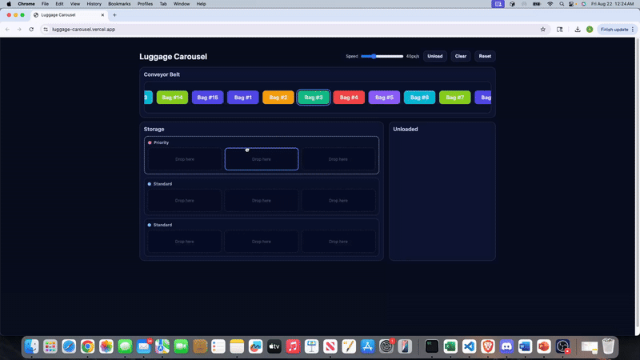
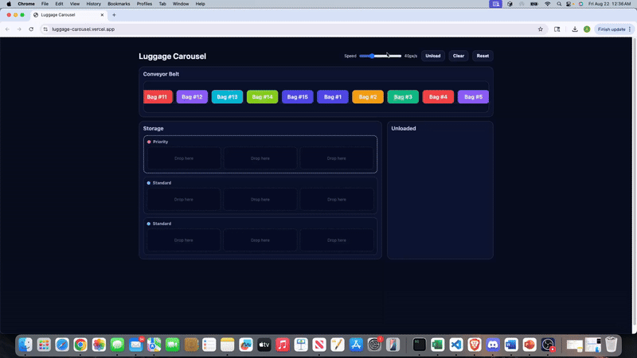

# Luggage Carousel

This project is a small interactive simulation of an airport luggage carousel, built with **React**, **TypeScript**, and **Vite**.  
It includes a moving conveyor belt with bags that can be dragged into storage slots, a priority row with special handling rules, and the ability to unload or clear luggage with animations.

---

## ✨ Features

- **Moving conveyor belt** – bags move infinitely from left to right.
- **Drag & drop** – built with [dnd-kit](https://github.com/clauderic/dnd-kit), so it works on both desktop and mobile devices.
- **Storage rows**  
  - 3 rows in total (3 columns each).  
  - The first row is the **priority row** (highlighted with dotted borders).  
- **Unloading logic**  
  - Bags in the priority row are always unloaded first.  
  - If no priority bags remain, unloading follows **Last-In-First-Out (LIFO)** order.  
- **Clear vs Reset**  
  - **Clear**: smoothly unloads all bags into the Unloaded section.  
  - **Reset**: restores everything to the initial state.  
- **Animations** – smooth fade and movement effects when unloading or clearing.  
- **Test suite** – basic UI test for drag & drop, plus reducer logic tests.

---

## 🎥 Demo
Here are a couple of short clips showing the key functionality of the luggage carousel app.

### 🛄 Unload demo
Shows dragging bags from the conveyor into storage slots, then unloading them into the Unloaded section.


### ⏩ Speed change & Clear demo
Shows adjusting the conveyor belt speed with the slider, clearing all stored luggage with smooth animations, and finally using reset.


👉 You can also try the live version here: [luggage-carousel on Vercel](https://luggage-carousel.vercel.app/)

---

## 🚀 Getting Started

### Prerequisites
- Node.js **18+**
- npm (or yarn/pnpm, if you prefer)

### Install dependencies
```bash
npm install


### Run
```bash
npm run dev
```

### Test
```bash
npm run test
```
